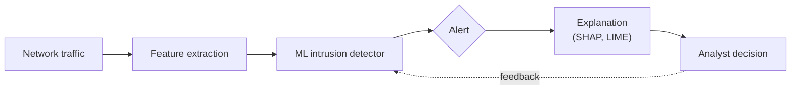

# Samuel Schwertfeger

**Ph.D. Student · Explainable AI for Intrusion Detection · U.S. Army Cyber Officer**

I am starting my Ph.D. research on explainable AI for cybersecurity: building intrusion detection systems whose alerts an analyst can understand, check, and trust.

[](https://www.augusta.edu/ccs/)
[](mailto:sschwertfeger@augusta.edu)
[](https://github.com/SamuelSchwertfeger/xai-intrusion-detection-papers)

## About Me

I am a first-year Ph.D. student in Computer and Cyber Sciences at Augusta University. My work sits at the intersection of cybersecurity, machine learning, and explainable AI.

Before my Ph.D., I earned a B.S. in Information Technology from Georgia Southern University, where I built a SIEM and IDS research lab as my capstone. I also serve as a Cyber officer in the U.S. Army National Guard.

## Research Direction

Machine learning detectors are good at flagging traffic and bad at saying why. The question driving my research is what happens between the alert and the analyst's decision.



<details>
<summary><b>The math behind a SHAP explanation</b></summary>
<br>

SHAP assigns each input feature $i$ its Shapley value: the average change in the model's output when $i$ is added, taken over every subset $S$ of the other features $F$.

```math
\phi_i = \sum_{S \subseteq F \setminus \{i\}} \frac{|S|!\,(|F|-|S|-1)!}{|F|!}\left[f(S \cup \{i\}) - f(S)\right]
```

For an IDS alert, a large $\phi_i$ points the analyst to the features (packet rate, port, flag counts) that pushed the model toward "malicious".

</details>

## Current Focus

- Explainable AI (XAI) for security systems
- Machine learning-based network intrusion detection
- Evaluating whether explanations actually help analysts
- Detection engineering with SIEM and IDS platforms

## Research Areas

| | | |
|---|---|---|
| Cybersecurity | Machine Learning | Explainable AI |
| Intrusion Detection | Network Security | Defensive Cyber Operations |

## Selected Projects

### [XAI for Intrusion Detection: Reading List](https://github.com/SamuelSchwertfeger/xai-intrusion-detection-papers)

A curated, verified list of papers on explainable AI for network intrusion detection: foundations, surveys, applied methods, evaluation, and datasets.

### SIEM/IDS Detection Lab

Undergraduate research at Georgia Southern University, advised by Dr. Hayden Wimmer.

<details>
<summary><b>Lab design and results</b></summary>
<br>

- Splunk Enterprise and Snort on Ubuntu 22.04, with Windows 11 and Kali Linux hosts in VMware
- Multi-stage attack simulation, including privilege escalation
- Detection playbooks validated at each stage of the attack
- Design mapped to the NIST SP 800-53 Audit and Accountability (AU) and Incident Response (IR) families

</details>

## Technical Stack

| Area | Tools |
|---|---|
| Languages | Python · Bash |
| ML / XAI | scikit-learn · pandas · NumPy · SHAP · LIME |
| Security | Splunk · Snort · Wireshark · Nmap · Kali Linux · Metasploit · Autopsy · pfSense |
| Infrastructure | VMware · Linux (Ubuntu, Fedora) · Windows Server · Cisco networking |

## Education

- **Ph.D., Computer and Cyber Sciences**, Augusta University (2026–present)
- **B.S., Information Technology**, minor in Military Science, Georgia Southern University (2026), *magna cum laude*
- **Cyber Security Certificate**, Georgia Southern University (2026)

<details>
<summary><b>Ask me about</b></summary>
<br>

- Building a SIEM/IDS lab from scratch
- Writing and testing Splunk detections against simulated attacks
- Hardening Windows Server and small networks
- The path from Army ROTC to the Cyber branch

</details>

## Contact

- University: sschwertfeger@augusta.edu
- Personal: schwertfeger.samuel@gmail.com

---

<sub>Views expressed here are my own and do not represent the U.S. Army or the Department of Defense.</sub>
