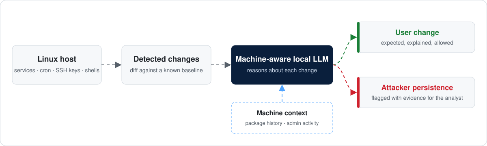

<p>
  <a href="https://www.augusta.edu/ccs/"></a>
  <a href="mailto:sschwertfeger@augusta.edu"></a>
</p>

First-year Ph.D. student in Computer and Cyber Sciences at Augusta University and U.S. Army Cyber officer.

## Research

**Machine-Aware Local Language Models: Separating User Changes from Attacker Persistence on Linux**

A new systemd service, cron job, or SSH key can be a routine change by the machine's owner or an attacker making sure they can get back in. Rule-based tools often flag both the same way. My research asks whether a local language model that knows the machine, including its package history and admin activity, can tell the two apart and explain its reasoning.



### The problem in one table

| Mechanism | MITRE ATT&CK | Routine user change | Attacker persistence |
|---|---|---|---|
| Cron job | [T1053.003](https://attack.mitre.org/techniques/T1053/003/) | Nightly backup script | Reverse shell every 5 minutes |
| systemd service | [T1543.002](https://attack.mitre.org/techniques/T1543/002/) | New web server after install | Disguised service that runs a payload at boot |
| SSH authorized keys | [T1098.004](https://attack.mitre.org/techniques/T1098/004/) | Admin adds a laptop's key | Unknown key added to root |
| Shell configuration | [T1546.004](https://attack.mitre.org/techniques/T1546/004/) | Alias added to `.bashrc` | Command in `.bashrc` that calls home on login |

<details>
<summary><b>Background: the math behind a SHAP explanation</b></summary>
<br>

Explaining a verdict matters as much as the verdict. SHAP, a standard baseline for explaining model decisions, assigns each input feature $i$ its Shapley value: the average change in the model's output when $i$ is added, taken over every subset $S$ of the other features $F$.

```math
\phi_i = \sum_{S \subseteq F \setminus \{i\}} \frac{|S|!\,(|F|-|S|-1)!}{|F|!}\left[f(S \cup \{i\}) - f(S)\right]
```

</details>

## Projects

**[XAI for Intrusion Detection: Reading List](https://github.com/SamuelSchwertfeger/xai-intrusion-detection-papers)**
A curated, verified list of papers on explainable AI for intrusion detection.

**SIEM/IDS Detection Lab** · Georgia Southern University, advised by Dr. Hayden Wimmer
Built a Splunk and Snort lab, ran a multi-stage attack against it, and validated detections at each stage against NIST SP 800-53.

## Tools

| Area | Tools |
|---|---|
| Languages | Python · Bash |
| ML / XAI | scikit-learn · pandas · NumPy · SHAP · LIME |
| Security | Splunk · Snort · Wireshark · Nmap · Kali Linux · Metasploit · Autopsy · pfSense |
| Infrastructure | VMware · Linux (Ubuntu, Fedora) · Windows Server · Cisco networking |

## Education

| Degree | Institution | Year |
|---|---|---|
| Ph.D., Computer and Cyber Sciences | Augusta University | 2026–present |
| B.S., Information Technology (*magna cum laude*) | Georgia Southern University | 2026 |
| Cyber Security Certificate | Georgia Southern University | 2026 |

## Contact

sschwertfeger@augusta.edu

---

<sub>Views expressed here are my own and do not represent the U.S. Army or the Department of Defense.</sub>
